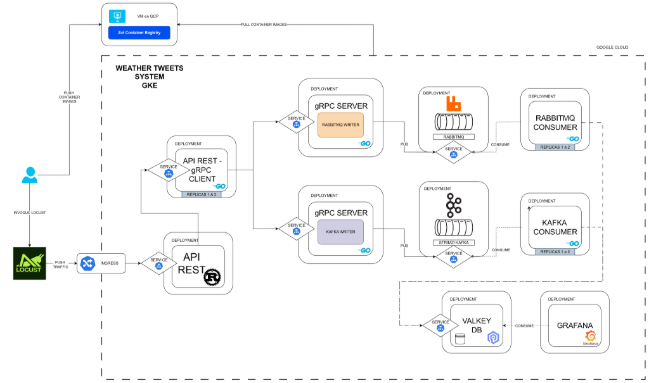
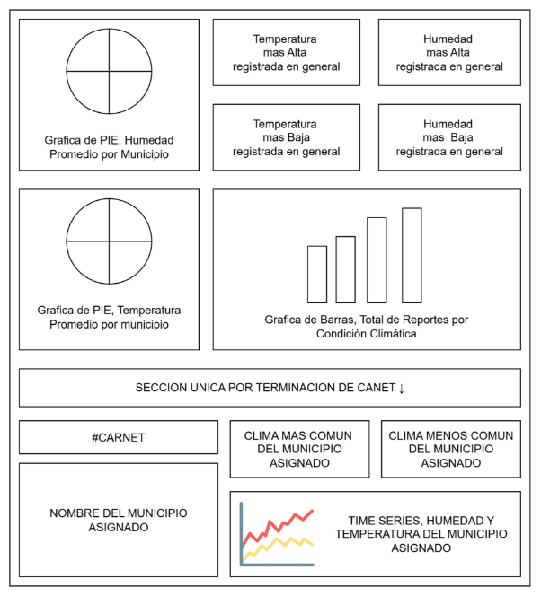

Sistemas Operativos 1 

Universidad San Carlos de Guatemala Facultad de ingeniería. 

Ingeniería en ciencias y sistemas 

# Arquitectura Distribuida en la Nube con Kubernetes 
**PONDERACIÓN:  50 Horas Aproximadas:  35![ref1]**

Índice 

1. [**Resumen Ejecutivo  3**](#_page2_x72.00_y72.00) **![ref1]**
1. [**Competencia que desarrollaremos  3**](#_page2_x72.00_y240.14)** 
1. **Objetivos del Aprendizaje  3** 
1. [Objetivo General  3](#_page2_x72.00_y591.31) 
1. [Objetivos Específicos  3](#_page2_x72.00_y665.66) 
4. [**Enunciado del Proyecto  5**](#_page4_x72.00_y97.80)** 
1. Descripción del problema a resolver  5 
1. [Alcance del proyecto  5](#_page4_x72.00_y253.74) 

   4. [Entregables  6](#_page8_x72.00_y338.56) 
5. [**Metodología  8**](#_page9_x72.00_y96.65)** 
5. [**Desarrollo de Habilidades Blandas  8**](#_page10_x72.00_y72.00)** 
   1. [**Proyectos Individuales  9**](#_page10_x72.00_y101.00) 
5. [**Cronograma  10**](#_page10_x72.00_y179.34)** 
5. [**Rúbrica de Calificación  11**](#_page11_x72.00_y97.80)** 
1. [Requisitos para optar a la calificación  11](#_page11_x72.00_y128.80) 
1. [**Resumen de Puntuaciones  12**](#_page11_x72.00_y369.23) 
1. [**Detalle de la Calificación  12**](#_page12_x72.00_y151.35) 
1. [Valores  14](#_page13_x72.00_y506.88) 
1. Comentarios Generales  14 
1. # Resumen Ejecutivo 
El proyecto "Tweets del Clima" tiene como propósito aplicar los conocimientos adquiridos en las unidades 1 y 2 del curso, enfocándose en la implementación de una arquitectura de sistema distribuido y escalable en Google Cloud Platform (GCP) utilizando Google Kubernetes Engine (GKE). Se construirá un sistema que simula la recepción y procesamiento de "tweets" sobre el clima local. Este sistema involucrará la generación de tráfico con Locust, una API REST en Rust, servicios en Go para procesamiento y publicación en message brokers (Kafka, RabbitMQ), consumidores para procesar estos mensajes, y bases de datos en memoria (Valkey) para almacenamiento, culminando en la visualización de datos con Grafana. El proyecto busca demostrar la comprensión y aplicación de tecnologías de contenedores, orquestación, comunicación entre microservicios, manejo de concurrencia y comparación de rendimiento de diferentes tecnologías de mensajería y almacenamiento. 
2. # Competencia que desarrollaremos 
Al finalizar este proyecto, el estudiante será competente en: 

- Diseñar e implementar arquitecturas de microservicios en un entorno de nube (GCP). 
- Orquestar contenedores utilizando Kubernetes (GKE), incluyendo deployments, services, ingress, y HPA. 
- Desarrollar servicios concurrentes en Go y Rust, aprovechando sus librerías y paradigmas. 
- Utilizar y configurar message brokers (Kafka, RabbitMQ) para la comunicación asíncrona entre servicios. 
- Integrar y gestionar bases de datos en memoria (Valkey) para el almacenamiento de datos de alta velocidad. 
- Implementar y utilizar un Container Registry (Zot) para la gestión de imágenes Docker. 
- Analizar y comparar el rendimiento de diferentes componentes tecnológicos en un sistema distribuido. 
- Generar y manejar carga de pruebas con herramientas como Locust. 
- Visualizar métricas y datos del sistema utilizando herramientas como Grafana. 
3. # Objetivos del Aprendizaje 
1. ## Objetivo General 
## Construir una arquitectura de sistema distribuido genérico en Google Kubernetes Engine (GKE) para simular el procesamiento de "tweets" sobre el clima local, aplicando conceptos de concurrencia, mensajería, almacenamiento en memoria y visualización, y comparando el rendimiento de diferentes tecnologías clave. 
2. ## Objetivos Específicos 
Al finalizar el proyecto, los estudiantes deberán ser capaces de: ![ref1]

1. **Administrar una arquitectura en la nube utilizando Kubernetes en GCP:** Configurar y desplegar múltiples componentes interconectados en GKE, gestionando recursos como pods, services, ingress, y HPA 
1. **Utilizar Go y Rust para desarrollo de servicios concurrentes:** Implementar los componentes de API (Rust) y los servicios de procesamiento y publicación (Go), maximizando su concurrencia y aprovechando sus librerías.. 
1. **Crear, desplegar y utilizar contenedores y un Container Registry:** Empaquetar todas las aplicaciones en imágenes Docker, publicarlas en un Container Registry privado (Zot) y desplegarlas en GKE.. 
1. **Entender y operar message brokers (Kafka y RabbitMQ):** Configurar, desplegar y utilizar Kafka y RabbitMQ para la comunicación asíncrona de mensajes, y comparar su rendimiento bajo carga. 
1. **Implementar un sistema de alta concurrencia para manejo de mensajes:** Diseñar el flujo de datos para soportar un alto volumen de mensajes generados por Locust, desde la recepción en la API hasta su procesamiento y almacenamiento. 
1. **Integrar y utilizar bases de datos en memoria (Valkey ) y visualización (Grafana):![ref1]** Almacenar datos procesados en Valkey , y visualizar esta información y métricas del sistema en un dashboard de Grafana. 
4. # Enunciado del Proyecto
## 4\.1 Descripción del problema a resolver 
## En la era digital, la cantidad de datos generados es masiva y requiere sistemas capaces de procesarlos en tiempo real o cuasi-real. Este proyecto simula un escenario donde se reciben "tweets" sobre el clima de diferentes partes del pais. El desafío es diseñar e implementar una arquitectura distribuida, escalable y resiliente que pueda ingerir estos datos, procesarlos, almacenarlos y visualizarlos, utilizando tecnologías modernas de nube y contenedores. Se busca no solo la funcionalidad, sino también la capacidad de analizar y comparar el rendimiento de diferentes componentes, como message brokers y bases de datos en memoria. 
## 4\.3 Alcance del proyecto 

Grafica en HD: [https://drive.google.com/file/d/1xd_uKJ_6Q9pJ66fJwinSK-5CKvBwni_q/view?usp=sh aring](https://drive.google.com/file/d/1xd_uKJ_6Q9pJ66fJwinSK-5CKvBwni_q/view?usp=sharing)  

*(se recomienda descargar el archivo y abrirlo en https://draw.io)* 

- **Componentes clave incluyen:** Locust (generador de carga), Ingress NGINX, API REST (Rust), Servicios gRPC (Go) para publicación en message brokers, Kafka, RabbitMQ, Consumidores (Go), Valkey (DB en memoria), Grafana para los dashboards y Zot (Container Registry). ![ref1]
3. ## Alcance del proyecto
- **Alcance obligatorio (basado en el documento provisto):** 
- **Locust:** Generación de tráfico con la estructura JSON especificada  (municipality, temperature, humidity, weather) hacia el Ingress Controller. 
- **Deployments de Rust:** API REST que recibe peticiones de Locust, envía a un Deployment de Go, soporta alta carga y escala con HPA (1-3 réplicas, CPU > 30%). 
- **Deployments de Go:** 
- **Deployment 1 (API REST y gRPC Client):** Recibe de Rust, actúa como cliente gRPC, invoca funciones para publicar en Kafka y RabbitMQ. 
- **Deployments 2 y 3 (gRPC Server y Writers):** Publican mensajes en Kafka y RabbitMQ respectivamente. Pruebas con 1 y 2 réplicas. 
- **Deployments de Kafka y RabbitMQ:** Almacenan y distribuyen mensajes. Comparar rendimiento. 
- **Deployments de Consumidores:** Dos deployments (uno para Kafka, otro para RabbitMQ) que consumen mensajes y almacenan datos extraídos en Valkey respectivamente. 
- **Deployments Valkey :** Almacenan datos procesados, con persistencia asegurada utilizando 2 réplicas por defecto,***  

  *Para la demostración práctica en la calificación presencial, se le pedirá que modifique este despliegue para utilizar un Horizontal Pod Autoscaler (HPA). No configure el HPA en su cluster antes de la sesión de evaluación; el objetivo es demostrar tu capacidad para aplicar este cambio de manera práctica en el momento.* 

- **Deployment Grafana:** Visualiza datos de Valkey  en un dashboard*. Instalación recomendada con Helm.* 
- **Zot:** Implementado en una VM de GCP fuera del clúster K8s. Todas las imágenes Docker de los componentes se publican y se descargan desde Zot. 
- **OCI Artifact:** Descarga de archivo de entrada desde el registry como un OCI Artifact (se debe especificar qué archivo y cómo se usa en la documentación) 
- **Documentación:** Responder preguntas específicas sobre Kafka, Valkey/RabbitQM, gRPC/HTTP, HPA, VPA, y mejoras con replicación. 
- **Sugerencias Generales:** Uso de namespaces, NGINX Ingress Controller, creación propia de imágenes Docker. 
- **Requisitos Mínimos:** Clúster de Kubernetes en GCP. 
- **Restricciones:** Proyecto individual, uso obligatorio de Locust y GKE **NO HABRÁ PRÓRROGA**. 
- **Github:** Repositorio privado, carpeta llamada ‘proyecto3’, agregar auxiliar. 
- **Alcance opcional (No puntuable, pero recomendado para evitar saturación de su sistema):** 
- Optimizar el rendimiento de los componentes con requests y limits. ![ref1]
- Agregar un tiempo de expiración para los datos en la db Valkey para evitar saturacion 
1. ### **Estructura de los TWEETS:**
syntax = "proto3"; package wethertweet; 

option go\_package = "./proto"; 

// Mensaje que se enviará 

message WeatherTweetRequest{ 

`    `Municipalities municipality  = 1;     int32 temperature   = 2;     int32 humidity   = 3;     Weathers weather    = 4; } 

// Lista de los únicos posibles municipios aceptados por el proyecto enum Municipalities { 

`    `municipalities\_unknown  = 0; 

`    `mixco        = 1; 

`    `guatemala   = 2; 

`    `amatitlan   = 3; 

`    `chinautla   = 4; 

} 

// Lista de los únicos posibles climas aceptados por el proyecto enum Weathers { 

`    `weathers\_unknown  = 0; 

`    `sunny    = 1; 

`    `cloudy   = 2; 

`    `rainy    = 3; 

`    `foggy    = 4; 

} 

// Respuesta del servidor message WeatherTweetResponse {     string status = 1; 

} 

// Servicio gRPC ![ref1]

service WeatherTweetService { 

`    `rpc SendTweet (WeatherTweetRequest) returns (WeatherTweetResponse); 

} 
2. ### **Estructura del Dashboard Requerido** 

Asignación de municipio en base al último dígito de su carnet: 

- 0,1,2  = mixco ![ref1]
- 3,4,5  = guatemala 
- 6,7   = amatitlan 
- 8,9   = chinautla 
4. ## Requerimientos técnicos 
- **Cloud:** Google Cloud Platform (GCP), Google Kubernetes Engine (GKE). 
- **Lenguajes de Programación:** Python (para Locust), Rust, Go. 
- **Contenerización:** Docker. 
- **Orquestación:** Kubernetes. 
- **Message Brokers:** Strimzi Kafka, RabbitMQ. 
- **Bases de Datos en Memoria:** Valkey. 
- **Visualización:** Grafana. 
- **Container Registry:** Zot. 
- **Generación de Carga:** Locust. 
- **Ingress Controller:** NGINX. 
- **Herramientas de Desarrollo:** Git, GitHub, IDEs/editores a elección. 
- **Sistema Operativo Local (para desarrollo y Locust):** Linux, macOS, o Windows con WSL2. 
5. ## Entregables 

|**Tipo** |**Descripción** |
| - | - |
|**Link de repositorio** |Todos los archivos de código fuente de los diferentes componentes (Rust, Go, Python para Locust si se personaliza), archivos de configuración de Kubernetes (YAMLs para Deployments, Services, Ingress, HPA, etc.), Dockerfiles para cada componente, scripts de apoyo. Organizados en la carpeta Proyecto3 en GitHub. |
|**Informe Técnico** |
En formato Markdown únicamente. Debe incluir:  Documentación de los deployments y una breve explicación con ejemplos. Instrucciones claras para desplegar y probar todo el sistema. Arquitectura del sistema (puede referenciar el diagrama proporcionado o mejorarlo). Conclusiones sobre el rendimiento y comparativas (Kafka vs RabbitMQ, Valkey con impacto de réplicas, API REST vs gRPC). 

Describa el proceso de desarrollo, los retos encontrados y cómo se resolvieron. 
|

***Es obligatorio la presentación de la documentación técnica para tener ![ref1]derecho a la calificación del proyecto.*** 
5. # Metodología 
1. **Fase 1: Configuración y Componentes Base (Semana 1)** 
- Configurar cuenta de GCP y crear clúster de GKE. 
- Instalar y configurar Zot en una VM en GCP. 
- Desarrollar y contenerizar la API REST en Rust. Publicar en Zot. 
- Desarrollar y contenerizar el Go Deployment 1 (API REST y gRPC Client). Publicar en Zot. 
- Configurar Locust para generar tráfico básico. 
- Desplegar NGINX Ingress Controller. 
- Pruebas iniciales de flujo: Locust -> Ingress -> API Rust -> Go Deployment 1. 
2. **Fase 2: Message Brokers y Writers (Semana 2)** 
- Desplegar Kafka (Strimzi) y RabbitMQ en GKE. 
- Desarrollar y contenerizar los Go Deployments 2 y 3 (gRPC Server y Writers para Kafka y RabbitMQ). Publicar en Zot. 
- Integrar Go Deployment 1 con los Writers. 
- Pruebas de publicación de mensajes en ambos brokers. 
3. **Fase 3: Consumidores y Bases de Datos en Memoria (Semana 2)** 
- Desarrollar y contenerizar los Consumidores (Go) para Kafka y RabbitMQ. Publicar en Zot. 
- Desplegar Valkey  en GKE, asegurando persistencia. 
- Integrar Consumidores para almacenar datos en Valkey . 
- Pruebas de consumo y almacenamiento. 
4. **Fase 4: Visualización y Pruebas de Carga (Semana 3)** 
- Desplegar Grafana (Helm recomendado) en GKE. 
- Configurar dashboards en Grafana para visualizar datos de Valkey . 
- Realizar pruebas de carga completas con Locust (10,000 peticiones, 10 usuarios concurrentes). 
- Implementar y probar HPA para el deployment de Rust. 
- Analizar rendimiento con 1 y 2 réplicas para los deployments de Go Writers. 
5. **Fase 5: Documentación y Entrega (Semana 4)** 
- Redactar el manual técnico, incluyendo respuestas a las preguntas y análisis de rendimiento. 
- Asegurar que todos los componentes estén correctamente configurados y documentados en el repositorio. ![ref1]
- Preparar la entrega final según los requisitos. 
6. # Desarrollo de Habilidades Blandas 
## 6.1 Proyectos Individuales 
Para complementar el desarrollo técnico, esta sección se centra en las habilidades blandas que los estudiantes deberán mejorar a lo largo del proyecto. Dado que este proyecto se plantea como individual, el enfoque es similar al Proyecto 1 pero con mayor énfasis en la gestión de complejidad. 

- **6.1.1 Autogestión del Tiempo y Complejidad:** El estudiante deberá gestionar un proyecto con múltiples componentes interdependientes y tecnologías diversas, requiriendo una excelente planificación y priorización para cumplir con los plazos. 
- **6.1.2 Responsabilidad y Compromiso Técnico:** Asumir la responsabilidad completa de una arquitectura compleja, desde el diseño conceptual hasta la implementación funcional y el análisis de rendimiento. 
- **6.1.3 Resolución Avanzada de Problemas y Depuración Distribuida:** Identificar y solucionar problemas en un sistema distribuido, donde los errores pueden ser difíciles de rastrear a través de múltiples servicios y tecnologías. 
- **6.1.4 Investigación y Aprendizaje Autónomo:** Investigar y aprender sobre múltiples tecnologías (Kubernetes, Kafka, RabbitMQ, Go, Rust, Grafana, etc.) y sus mejores prácticas de implementación e integración. 
- **6.1.5 Documentación Técnica y Comunicación de Resultados:** Elaborar un manual técnico claro y conciso que no solo describa el sistema, sino que también analice y justifique decisiones de diseño y compare el rendimiento de tecnologías. 
7. # Cronograma ![ref1]

|Tipo |Fecha Inicio |Fecha Fin |
| - | - | - |
|Asignación de Proyecto |25/09/2025 |22/10/2025 |
|Calificación |23/10/2025 |25/10/2025 |
8. # Rúbrica de Calificación 
1. ## Requisitos para optar a la calificación 
Antes de la evaluación del proyecto, los estudiantes deben cumplir con los requisitos que se indiquen en esta sección. 

|Tema |Descripción |Cumple (Si/No) |
| - | - | :- |
|**Entrega Completa** |Se entrega el enlace al repositorio privado de GitHub (con acceso al auxiliar) conteniendo todo el código fuente, Dockerfiles, YAMLs de Kubernetes y la documentación técnica. ||
|**Funcionalidad del Clúster en GCP (GKE)** |El sistema está desplegado y es funcional en un clúster de GKE. ||
2. ## Resumen de Puntuaciones ![ref1]

|**Área** |**Puntos Totales** |**Puntos Obtenidos** |
| - | - | :- |
|1\. Conocimiento técnico (85%) |||
|Arquitectura General y Despliegue en GKE/Zot |15 ||
|Servicios de Ingesta y Procesamiento (Rust, Go) |20 ||
|Message Brokers y Consumidores (Kafka, RabbitMQ) |10 ||
|Almacenamiento y Visualización (Valkey, Grafana) |20 ||
|**Sub-Total Conocimiento** |**65** ||
|2\. Análisis, Documentación y Cumplimiento (30%) |||
|Pruebas de Carga, HPA y Análisis de Réplicas |10 ||
|Manual Técnico y Respuestas a Preguntas |20 ||
|**Sub-Total Habilidades** |**35** ||
|**TOTAL** |**100** ||
\*La calificación debe incluir ambas áreas conocimientos y habilidades. 
3. ## Detalle de la Calificación ![ref1]

|**Criterio** |**Descripción** |**Puntos Máximos** |**Puntuació n Obtenida** |
| - | - | :- | :- |
|1\. Implementación funcional** ||||
|**1. Funcionalidad del Sistema** ||**70** ||
|**1.1.1 Arquitectura General Despliegue en GKE** |Despliegue completo y funcional de todos los componentes en GKE. Configuración de Ingress, Services, Deployments, HPA. |5 ||
|**1.1.2 Arquitectura General Despliegue (Ingress Controller)** |Implementación de Ingress en Kubernetes para la exposición y acceso al sistema desplegado |5 ||
|**1.1.3 Arquitectura General Despliegue en Zot** |Despliegue completo y funcional de todos los componentes en GCP. Uso correcto de Zot para imágenes Docker. |10 ||
|**1.2.1 Servicios de Ingesta y Procesamiento (Rust)** |API REST/gRPC en Rust funcionando y escalando.  |5 ||
|**1.2.2 Servicios de Ingesta y Procesamiento (Go)** |Servicios en Go (API/gRPC Client, gRPC Server/Writers) implementados correctamente, con manejo de concurrencia y comunicación gRPC. |10 ||
|**1.3 Message Brokers y Consumidores (Kafka y RabbitMQ)** |Kafka y RabbitMQ desplegados y configurados. Los Writers publican mensajes correctamente. Los Consumidores leen las colas/tópicos y procesan los mensajes. |10 ||
|**1.4 Almacenamiento (Valkey)** |Valkey desplegado con persistencia. Los Consumidores almacenan datos en ellos.  |15 ||
|**1.5 Dashboard Grafana** |Visualización de los datos requeridos en Grafana |10 ||
|**Sub-Total de Puntos** ||**70** ||
|2\.Análisis, Documentación y Cumplimiento ||||
|**2.1 Pruebas de Carga, HPA y Análisis de Réplicas** |Locust genera la carga especificada. la API Rust funciona según lo definido. Se realizan y documentan pruebas comparativas con 1 y 2 réplicas para Go Writers y Valkey, analizando rendimiento. |**10** ||
|**2.2 Informe Técnico**  |El informe es claro, completo, incluye todas las secciones requeridas (despliegue, ejemplos, arquitectura, conclusiones).  |**10** ||
|**2.3 Respuestas a Preguntas** |Se responden de forma correcta y justificada todas las preguntas planteadas durante la calificación. |**10** ||
|**Sub-Total de Puntos** ||**30** ||
|**Total** ||**100** ||
4. ## Valores 
En el desarrollo del proyecto, se espera que cada estudiante demuestre honestidad académica y profesionalismo. Por lo tanto, se establecen los siguientes principios: 

1. **Originalidad del Trabajo** 
- Cada estudiante debe desarrollar su propio código, configuraciones y/o documentación, aplicando los conocimientos adquiridos en el curso. 
2. **Prohibición de Copias y Plagio** 
- (Según el documento del proyecto) Cualquier copia parcial o total tendrán nota de **0 puntos** y serán reportadas al catedrático y a la Escuela de Ciencias y Sistemas. 
- Esto incluye la reproducción de código entre compañeros, la reutilización de proyectos de semestres anteriores o el uso de código externo sin la debida referencia (ver punto 3). 
3. **Uso Responsable de Recursos Externos** ![ref1]
- El uso de librerías, frameworks, plantillas de configuración de Kubernetes, y ejemplos de código externos (ej. de tutoriales, documentación oficial) está permitido para aprendizaje y como base, siempre y cuando se referencian correctamente (si se adapta una porción significativa) y se comprendan plenamente. El diseño y la integración de la arquitectura deben ser originales. (Consultar con el catedrático su política específica). 
4. **Revisión y Detección de Plagio** 
- Se podrán utilizar herramientas automatizadas y revisiones manuales para identificar similitudes en los proyectos. 
- En caso de sospecha, el estudiante deberá justificar su código y demostrar su desarrollo individual. Si este extremo no es comprobable la calificación será de **0 puntos**. 

Al detectarse estos aspectos se informará al catedrático del curso quien realizará las acciones que considere oportunas. 

**PENALIZACIONES** 

**Penalización por Entrega Tardía:** (Según el documento del proyecto) Si el proyecto se envía después de la fecha límite, se aplicará una penalización del 25% en la puntuación asignada cada 12 horas después de la fecha límite. Esto significa que, por cada período de 12 horas de retraso, se reducirá un 25% de los puntos totales posibles. La penalización continuará acumulándose hasta que el trabajo alcance un retraso de 48 horas (2 días). Después de este punto, si el trabajo se envía, la puntuación asignada será de 0 puntos.

**Penalización por falta de Documentación:** De no presentar la documentación requerida del proyecto se aplicará una penalización del 100% en la puntuación final. Lo que dará una nota automática de 0 puntos. 

**Penalización por falta de uso de Grafana:** De no presentar el dashboard requerido con todas sus partes se aplicará una penalización del 100% en la puntuación final del proyecto. Lo que dará una nota automática de 0 puntos. 

**Penalización por falta de uso de gRPC y Locust:** En caso no pueda demostrar el uso de gRPC y Locust para las comunicaciones entre APIs y carga masiva respectivamente, se aplicará una penalización del 100% en la puntuación final del proyecto. Lo que dará una nota automática de 0 puntos. 

**Penalización por falta de uso Valkey:** En caso no pueda demostrar el uso de Valkey como base de datos en memoria para mantener la información que grafana consumirá para su dashboard, se aplicará una penalización del 100% en la puntuación final del proyecto. Lo que dará una nota automática de 0 puntos. 

**Penalización por falta de uso de  Kafka, RabbitMQ:** En caso no pueda demostrar el uso de Kafka y RabbitMQ como message brokers para el procesamiento de los ‘weathertweets’, se aplicará una penalización del 100% en la puntuación final del proyecto. Lo que dará una nota automática de 0 puntos. 

**Penalización por falta de uso de Google Cloud Platform y/o Ingress Controller de Kubernetes:![ref1]** Nota automática de 0 pts. 
5. ## Método de Calificación Presencial 
Para que la calificación de su proyecto 3 sea rápida y exitosa, usted como estudiante deberá tener listo una serie de requisitos para amenizar y optimizar su tiempo de calificación, estos requisitos son los siguientes:  

1. Tener previamente levantado, listo y funcionando su cluster de kubernetes en GCP  (se recomienda tenerlo listo y funcionando desde una noche antes) 
1. Tener previamente encendida su VM donde aloja el Zot Registry (igualmente desde horas o una noche antes) 
1. Tener una terminal abierta, lista y conectada a su cluster de kubernetes para ejecutar los siguientes comandos cuando sean solicitados: 
1. kubectl get all 
1. kubectl get namespaces 
1. kubectl get ingress 
4. Tener un navegador web con las siguientes pestañas abiertas: 
1. Interfaz de Zot Registry desde la IP de su VM (<IP-VM>:5000). 
1. Repositorio de Github con la documentación técnica requerida. 
1. Dashboard de Grafana solicitado (sin mostrar ningún dato del clima *NO DATA*). 
1. Una pestaña donde se pueda observar al auxiliar como colaborador del repositorio privado en Github. 
1. Una serie de pestañas de su Repositorio de Github donde se pueda observar el código de cada tecnológica solicitada para este proyecto: 
1. API Rust (una del código y otra pestaña del archivo yaml) 
1. gRPC Go 
1. Servers/Writers y Consumers de Go 
1. Kafka y RabbitMQ (Dockerfile o archivo yaml) 
1. Base de datos Valkey (Dockerfile o archivo yaml) 
1. Ingress Controller (archivo yaml) 
5. Tener Locust abierto y listo para una carga masiva a su sistema cuando el auxiliar lo solicite 

***NOTA: Para la calificación, la base de datos debe comenzar vacía. (**Esto me permitirá observar en tiempo real, mediante Grafana, cómo el sistema y la DB procesan la carga masiva de datos generada por Locust.)* 

***De no tener vacía su base de datos o no mostrar las pestañas de su repositorio github con las tecnologías solicitadas se asumirá que no cumplio con los requisitos del proyecto y se aplicaran las penalizaciones correspondientes.![ref1]***

[ref1]: Aspose.Words.e88a3c88-4f78-47a4-a525-03fa85672b0a.003.png
